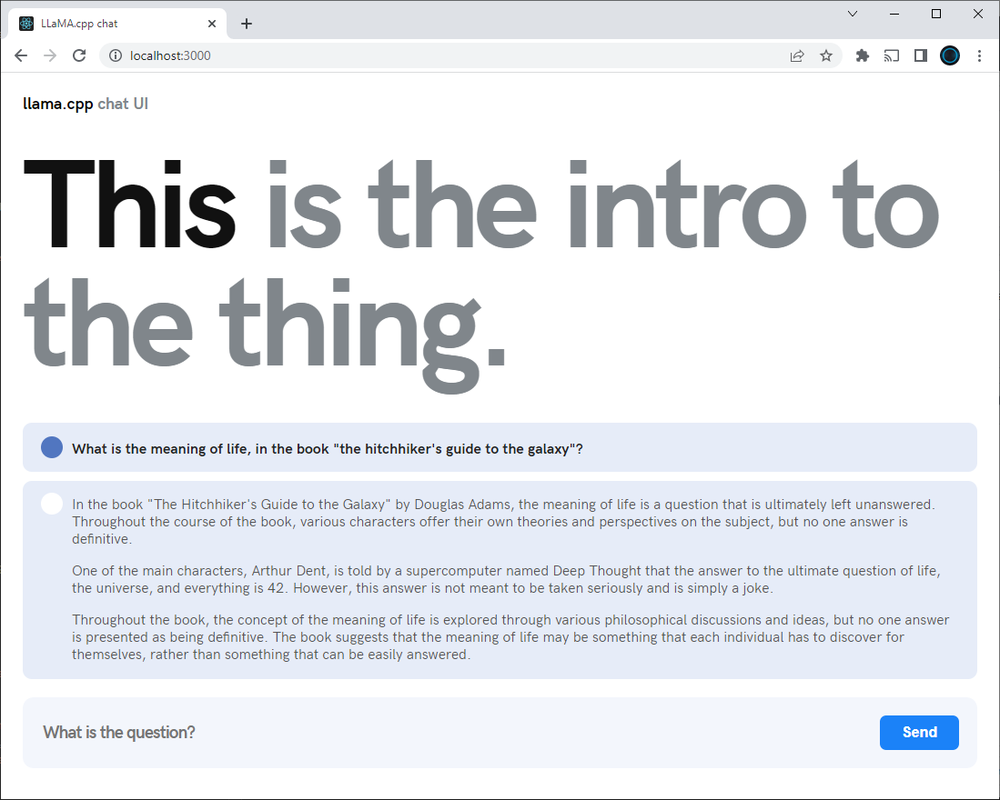
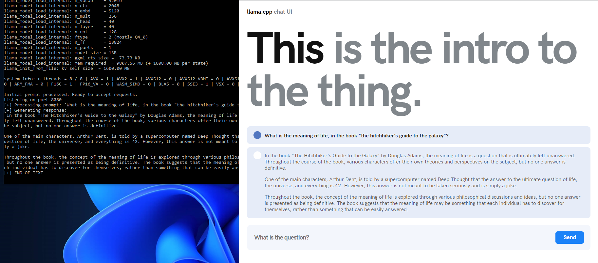

# llama-cpp-ui

A web API and frontend UI for llama.cpp written in C++. No python or other dependencies needed. Everything is self-contained in a single executable




## Running

Download some LLaMA compatible models, convert to `ggml` format as described in the [llama.cpp repository](https://github.com/ggerganov/llama.cpp).

Invoke like this:

```shell
> webapi.exe --model models\oasst\llama-13b-pretrained-sft-do2-ggml-f16.bin --temp 0.1 -n 256 -t 8 -p "<|system|>You are a helpful assistant. You enjoy giving long explanatory answers. Use markdown." --ctx_size 2048
llama.cpp: loading model from models\oasst\llama-13b-pretrained-sft-do2-ggml-q4.bin
llama_model_load_internal: format     = ggjt v1 (latest)
llama_model_load_internal: n_vocab    = 32016
llama_model_load_internal: n_ctx      = 2048
llama_model_load_internal: n_embd     = 5120
llama_model_load_internal: n_mult     = 256
llama_model_load_internal: n_head     = 40
llama_model_load_internal: n_layer    = 40
llama_model_load_internal: n_rot      = 128
llama_model_load_internal: ftype      = 2 (mostly Q4_0)
llama_model_load_internal: n_ff       = 13824
llama_model_load_internal: n_parts    = 1
llama_model_load_internal: model size = 13B
llama_model_load_internal: ggml ctx size =  73.73 KB
llama_model_load_internal: mem required  = 9807.56 MB (+ 1608.00 MB per state)
llama_init_from_file: kv self size  = 1600.00 MB

system_info: n_threads = 8 / 8 | AVX = 1 | AVX2 = 1 | AVX512 = 0 | AVX512_VBMI = 0 | AVX512_VNNI = 0 | FMA = 1 | NEON = 0 | ARM_FMA = 0 | F16C = 1 | FP16_VA = 0 | WASM_SIMD = 0 | BLAS = 0 | SSE3 = 1 | VSX = 0 |

Initial prompt processed. Ready to accept requests.
Listening on port 8080

[+] Processing prompt: 'What is the meaning of life, in the book "the hitchhiker's guide to the galaxy"?'
[+] Generating response:
In the book "The Hitchhiker's Guide to the Galaxy" by Douglas Adams, the meaning of life is a
question that is ultimately left unanswered. Throughout the course of the book, various 
characters offer their own theories and perspectives on the subject, but no one answer is 
definitive.

One of the main characters, Arthur Dent, is told by a supercomputer named Deep Thought that the 
answer to the ultimate question of life, the universe, and everything is 42. However, this 
answer is not meant to be taken seriously and is simply a joke.

Throughout the book, the concept of the meaning of life is explored through various 
philosophical discussions and ideas, but no one answer is presented as being definitive. The 
book suggests that the meaning of life may be something that each individual has to discover for
themselves, rather than something that can be easily answered.
[+] END OF TEXT                                                                                                                                                                                            
```



## Build from sources

Clone the repo and the submodules

```shell
$ git clone https://github.com/shimasakisan/llama-cpp-ui
$ cd llama-cpp-ui
$ git submodule update
```

There is a server and a frontend. To build the server: 

```shell
$ cd server
$ mkdir build
$ cd build
$ cmake ..
$ cmake --build . --config Release
```

The frontend is a react application created with create-react-app: 

```shell
$ cd frontend
$ npm install
$ npm start
```

This will start a development server. To create a deployment build: 

```shell
$ npm run build
```

The output ready to be published will be generated in a new `build` directory. 

# TO DO

* How to build the single file for the app.
* Compilation instructions in different OSs.
