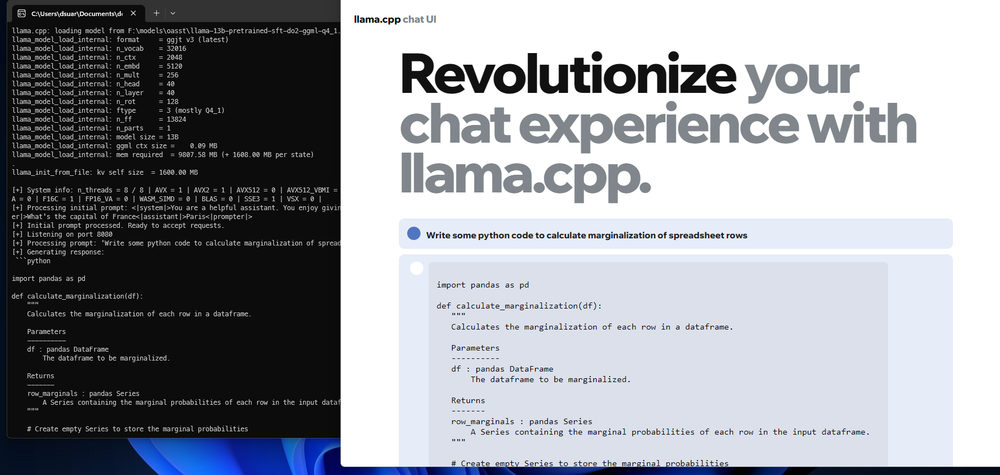

# llama-cpp-ui

A web API and frontend UI for llama.cpp written in C++. No python or other dependencies needed. Everything is self-contained in a single executable, including a basic chat frontend.




## Build from sources

Clone the repo and the submodules

```shell
$ git clone https://github.com/shimasakisan/llama-cpp-ui
$ cd llama-cpp-ui
$ git submodule update
```

The frontend is a react application created with create-react-app: 

```shell
$ cd frontend
$ npm install
$ npm start
```

This will start a development server. To create a deployment build: 

```shell
$ npm run build
```

The output ready to be published will be generated in a new `build` directory. **This step is required** before building the server,
since it generates an include file with the contents of the web app to be embedded in the webserver.

There is a server and a frontend. To build the server: 

```shell
$ cd server
$ mkdir build
$ cd build
$ cmake ..
$ cmake --build . --config Release
```

After, this, a single executable `webapi.exe` is generated with the webserver. 


# Running

Running the Open Assistant model quantized from https://huggingface.co/dvruette/llama-13b-pretrained-sft-do2 (follow instructions in the llama.cpp repo to get the ggml model format):

```
> webapi.exe --model f:\models\oasst\llama-13b-pretrained-sft-do2-ggml-q4_1.bin  --temp 0.1 --threads 8 --ctx_size 2048  --system_prompt "<|system|>You are a helpful assistant. You enjoy giving long explanatory answers. Use markdown." --prompt_prefix "<|prompter|>"  --prompt_suffix "<|assistant|>"

llama.cpp: loading model from F:\models\oasst\llama-13b-pretrained-sft-do2-ggml-q4.bin
llama_model_load_internal: format     = ggjt v1 (latest)
llama_model_load_internal: n_vocab    = 32016
llama_model_load_internal: n_ctx      = 2048
llama_model_load_internal: n_embd     = 5120
llama_model_load_internal: n_mult     = 256
llama_model_load_internal: n_head     = 40
llama_model_load_internal: n_layer    = 40
llama_model_load_internal: n_rot      = 128
llama_model_load_internal: ftype      = 2 (mostly Q4_0)
llama_model_load_internal: n_ff       = 13824
llama_model_load_internal: n_parts    = 1
llama_model_load_internal: model size = 13B
llama_model_load_internal: ggml ctx size =  73.73 KB
llama_model_load_internal: mem required  = 9807.56 MB (+ 1608.00 MB per state)
llama_init_from_file: kv self size  = 1600.00 MB

system_info: n_threads = 8 / 8 | AVX = 1 | AVX2 = 1 | AVX512 = 0 | AVX512_VBMI = 0 | AVX512_VNNI = 0 | FMA = 1 | NEON = 0 | ARM_FMA = 0 | F16C = 1 | FP16_VA = 0 | WASM_SIMD = 0 | BLAS = 0 | SSE3 = 1 | VSX = 0 |

Initial prompt processed. Ready to accept requests.
[+] Listening on http://127.0.0.1:8080

```

By default the web server will listen on the local interface on port 8080.


# TO DO

* How to build the single file for the app.
    * Done, have to document the build process: npm run build before buulding the server.
* Compilation instructions in different OSs.
